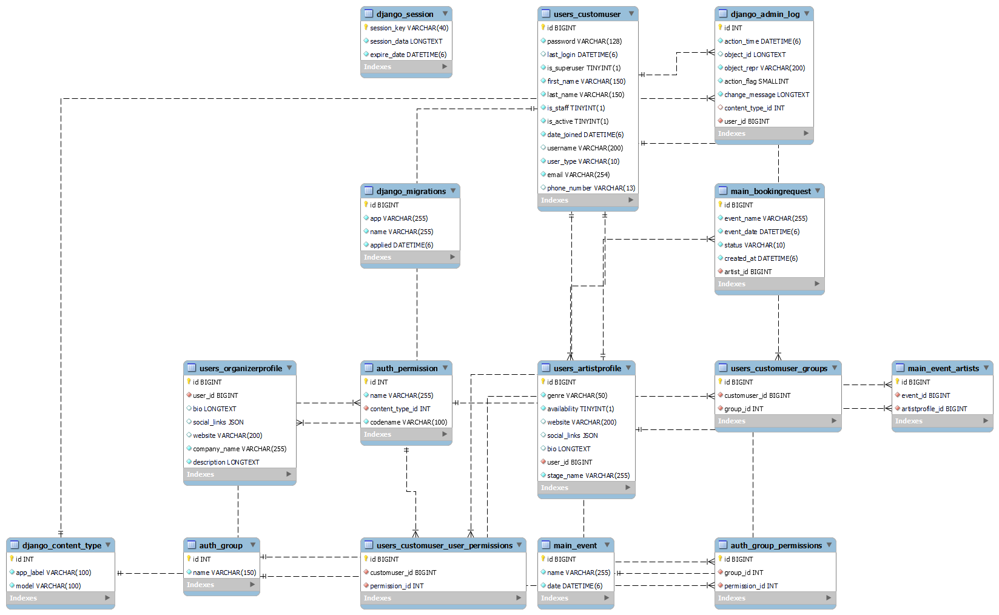

## Music Booking API

Designed to streamline the process of finding, booking and managing live performances, gigs and events for musicians, venues and promoters.

---

## **Project Overview**

The Event Booking API allows **organizers** to book **artists** for events.

- **Artists** can manage bookings and accept/reject requests.
- **Organizers** can book artists and view event details.
- **Authentication** is handled via **JWT tokens**.

---

## **Tech Stack**

- **Python** (Django & Django REST Framework)
- **Django REST Framework Simple JWT** (for authentication)
- **PostgreSQL** (for database)
- **Pipenv** (for virtual environment management)

---

## **Installation & Setup**

### **1. Clone the repository**

```sh
git clone https://github.com/your-repo/music-booking-api.git
cd music-booking-api
```

### **2. Set up the virtual environment with Pipenv**

```sh
pip install pipenv
pipenv install
```

### **3. Apply database migrations**

```sh
python manage.py migrate
```

### **4. Create a superuser (optional, for admin access)**

```sh
python manage.py createsuperuser
```

### **5. Run the server**

```sh
python manage.py runserver
```

### API Documentation is found at http://localhost:8000/api/swagger/

---

## **Authentication**

The API uses **JWT authentication**. To get a token, log in with your credentials:

---

## **Database URL**

[DATABASE URL](https://console.neon.tech/app/projects/round-queen-71993030?branchId=br-wispy-paper-a5duk50j)

## **API DOCUMENTATION**

[API Documentation](http://localhost:8000/api/swagger/)

## **Database Schema**



### **Login**

#### **POST /auth/login/**

```json
{
  "username": "testuser", //Can be either email or phone number
  "password": "testpass"
}
```

**Response:**

```json
{
  "access": "jwt-access-token",
  "refresh": "jwt-refresh-token"
}
```

### **Register User**

#### **POST /auth/register/**

```json
{
  "email": "user-email",
  "phone_number": "user-phone-number",
  "password": "user-password",
  "user_type": "artist"//Values can either be artist or organizer
}
```

**Response**

```json
{
  "username": null,
  "email": "user@email.com",
  "phone_number": "049594049499",
  "user_type": "artist"
}
```

To authenticate requests, include the token in the **Authorization** header:

```sh
Authorization: Bearer jwt-access-token
```

---

## **API Endpoints**

### **1. Artists**

#### **Create an artist profile**

✅ **Only authenticated users with the "artist" role can create an artist profile.**

#### **POST /auth/artists/**

```json
{
  "stage_name": "DJ Khaled",
  "social_links": { "href": "www.xyz.com", "x": "www.x.com" },
  "website": "http://www.xyz.com",
  "bio": "Top music producer",
  "genre": "Hip-hop"
}
```

**Response:**

```json
{
  "id": 1,
  "user": 2,
  "stage_name": "DJ Khaled",
  "bio": "Top music producer",
  "genre": "Hip-hop",
  "social_links": { "href": "www.xyz.com", "x": "www.x.com" },
  "website": "http://www.xyz.com"
}
```

---

### **2. Organizers**

#### **Create an organizer profile**

✅ **Only authenticated users with the "organizer" role can create an organizer profile.**

#### **POST /auth/organizers/**

```json
{
  "company_name": "Top Events",
  "description": "We manage big concerts",
  "social_links": {"href": "www.xyz.com", "x": "www.x.com"},
  "website": "http://www.xyz.com",
}
```

**Response:**

```json
{
  "id": 1,
  "user": 3,
  "company_name": "Top Events",
  "description": "We manage big concerts"
  "social_links": {"href": "www.xyz.com", "x": "www.x.com"},
  "website": "http://www.xyz.com",
}
```

---

### **3. Booking Requests**

#### **Create a booking request**

✅ **Only organizers can request bookings.**  
✅ **An artist cannot be double-booked for the same date.**

#### **POST /api/bookings/**

```json
{
  "artist": 1,
  "event_name": "Summer Festival",
  "event_date": "2025-06-20T18:00:00Z"
}
```

**Response:**

```json
{
  "id": 1,
  "artist": 1,
  "event_name": "Summer Festival",
  "event_date": "2025-06-20T18:00:00Z",
  "status": "pending",
  "created_at": "2025-04-02T12:00:00Z"
}
```

#### **Accept or Decline a Booking (Artist Only)**

✅ **Artists can approve or decline bookings.**

#### **PATCH /bookings/{id}/**

```json
{
  "status": "accepted"
}
```

**Response:**

```json
{
  "id": 1,
  "artist": 1,
  "event_name": "Summer Festival",
  "event_date": "2025-06-20T18:00:00Z",
  "status": "accepted"
}
```

---

### **4. Events**

#### **Retrieve confirmed events**

✅ **Only confirmed bookings create an event.**

#### **GET /api/events/**

**Response:**

```json
[
  {
    "id": 1,
    "name": "Summer Festival",
    "date": "2025-06-20T18:00:00Z",
    "artists": [1]
  }
]
```

---

## **Sample API Responses**

### **Invalid Booking Request (Artist Already Booked)**

#### **POST /api/bookings/**

```json
{
  "artist": 1,
  "event_name": "Winter Fest",
  "event_date": "2025-06-20T18:00:00Z"
}
```

**Response (400 Bad Request):**

```json
{
  "error": "Artist is already booked for this date."
}
```

### **Unauthorized Access (No Token Provided)**

#### **GET /auth/artists/**

**Response (401 Unauthorized):**

```json
{
  "detail": "Authentication credentials were not provided."
}
```

---

## **Conclusion**

This API allows **organizers to book artists, artists to manage their bookings, and ensures role-based authentication**.

- **Next steps:**
   Consider adding notifications, payments, or reviews. 🚀
   Consider an application process for registering artists.
